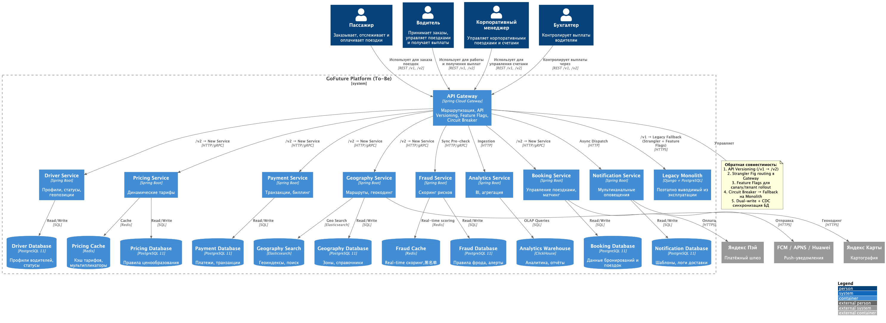

# Диаграмма C2 (To-Be) и механизмы обратной совместимости

## Контекст
Поэтапная замена монолита микросервисами требует нулевого downtime для клиентов и мобильных приложений. Необходимо реализовать прозрачную маршрутизацию трафика между legacy-монолитом и новыми сервисами, обеспечить версионирование API и гарантировать отказоустойчивость на каждом этапе Strangler Fig.

## Требования
- Единая точка входа для всех клиентов (мобильные, веб, партнёры).
- Возможность маршрутизировать запросы либо к монолиту, либо к новому сервису без изменений на клиенте.
- Поддержка нескольких версий API одновременно.
- Механизмы fallback при недоступности нового сервиса.
- Визуализация в нотации C2 (C4-PlantUML).

## Решение

### Диаграмма C2 To-Be (PlantUML)
Файл: `Task1/c2-to-be.puml`

### Механизмы обратной совместимости
| Механизм | Реализация | Принцип/Паттерн |
|----------|------------|-----------------|
| **Strangler Fig + API Gateway** | Gateway анализирует пути/заголовки и направляет запрос к новому сервису или монолиту. По мере миграции вес маршрутов меняется. | Structural: Facade, Routing Strategy |
| **API Versioning** | Поддержка `/v1` (монолит) и `/v2` (микросервисы). Переход на `/v2` управляется через header `Accept-Version` или feature flag. | Interface Segregation Principle, Contract-First |
| **Feature Flags** | База/Redis-хранилище флагов. Включение функциональности по `tenant_id`, `% rollout` или регионам. | Configuration Pattern, KISS |
| **Circuit Breaker + Fallback** | Resilience4j в Gateway. При недоступности нового сервиса запрос автоматически ретраится или направляется в монолит (fallback). | GoF: State + Proxy, Resilience |
| **Dual-Write + CDC** | На этапе миграции данные пишутся в обе БД. Debezium синхронизирует изменения. Cut-over происходит после верификации консистентности. | Data Synchronization Pattern |

## Альтернативы
| Вариант | Плюсы | Минусы | Причина отклонения |
|---------|-------|--------|-------------------|
| Прямой cut-over (Big-Bang) | Мгновенный переход | Downtime >30 мин, риск потери данных, невозможность отката | Нарушает NFR (MTTR <1ч, 99.95% SLA) |
| Клиентская маршрутизация | Простота на backend | Жёсткая зависимость от релизов мобильных приложений, невозможность A/B тестов | Нарушает принцип независимого деплоя |
| Отдельные прокси на каждый сервис | Изоляция | Сложность управления, дублирование логики авторизации/логирования | Нарушает KISS и DRY |

## Компромиссы
- **Сложность Gateway**: Центральная точка маршрутизации требует тщательного тестирования и observability. Решается выделением отдельной SRE-команды и автоматическим canary-деплоем.
- **Временное дублирование данных**: Dual-write увеличивает нагрузку на БД на 10–15%. Компенсируется отключением после cut-over и использованием CDC.
- **Отложенная очистка кода**: Legacy-маршруты остаются в Gateway до полного вывода монолита. Требуется регулярный аудит dead-routes.