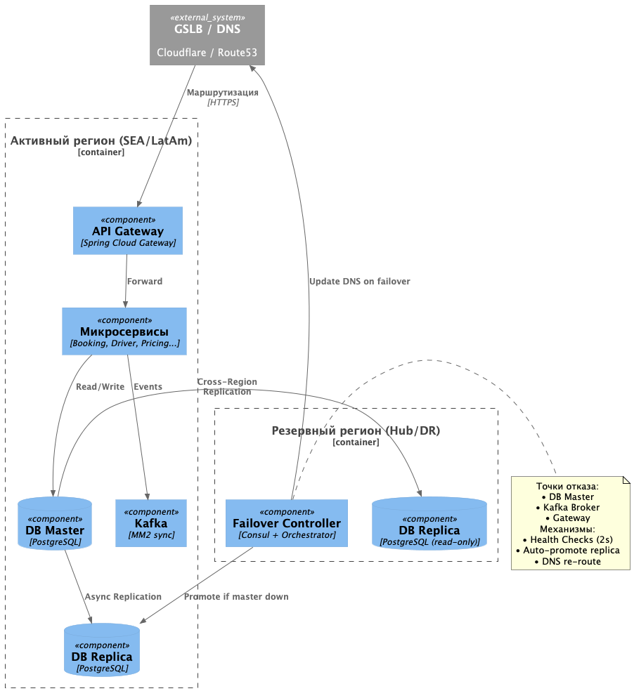
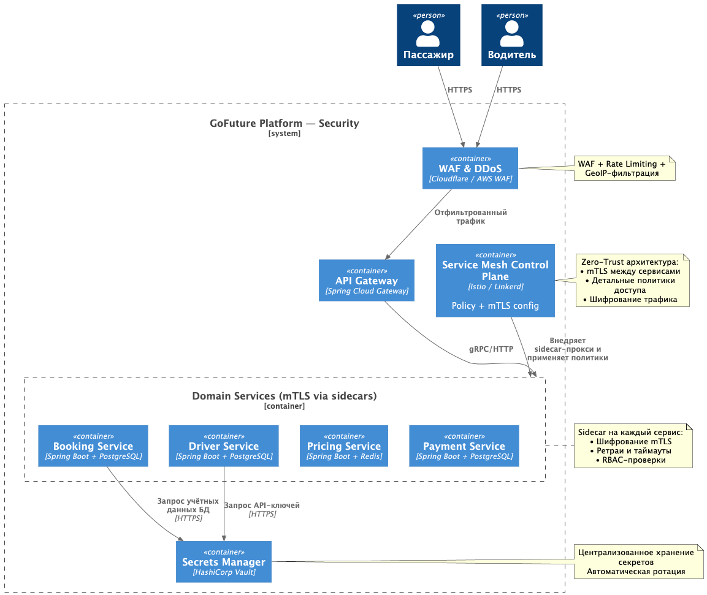

# Задание 3. Обеспечиваем высокую нагрузку

## Контекст

Монолит `GoFuture` не поддерживает мультирегиональное развёртывание. Для экспансии в ЮВА и ЛатАм с требованиями 99.99%
availability, latency <50 мс и соответствия локальным регуляторным нормам необходимо спроектировать глобальный ландшафт,
схему репликации, геомаршрутизацию, автоматический failover и усилить контур безопасности.

## Требования

- Развёртывание в ≥3 географических регионах.
- Схема репликации данных с целевыми `RPO ≤ 5 мин`, `RTO ≤ 2 мин`.
- Геомаршрутизация к ближайшему здоровому региону.
- C4-диаграмма failover с точками отказа и таблицей сценариев.
- Стратегия комплаенса (GDPR/PDPA/LGPD).
- Обновлённая C2 с security-инструментами (WAF, Service Mesh, Vault).

---

## Решение

### 1. Выбор регионов (обоснование)

| Регион                      | Роль                | Обоснование                                                                             |
|-----------------------------|---------------------|-----------------------------------------------------------------------------------------|
| `eu-central-1` (Франкфурт)  | Hub / Control Plane | Центр управления, CI/CD, агрегированная аналитика. Стабильная сеть, низкий egress cost. |
| `ap-southeast-1` (Сингапур) | SEA Production      | Покрытие Индонезии, Вьетнама, Филиппин. Соответствие PDPA. 3 AZ, latency <30 мс.        |
| `sa-east-1` (Сан-Паулу)     | LatAm Production    | Покрытие Бразилии, Аргентины. Соответствие LGPD. Прямой пиринг с локальными ISP.        |
| `us-west-2` (Орегон)        | DR / Backup         | Холодный резерв. Репликация только агрегированных данных и метрик.                      |

**Принцип:** запись всегда идёт в локальный мастер региона. Чтение распределяется на локальные реплики. Cross-region
репликация используется только для аналитики и disaster recovery.

---

### 2. Схема репликации данных

| Компонент    | Механизм                            | Направление                                               | Консистентность                                 |
|--------------|-------------------------------------|-----------------------------------------------------------|-------------------------------------------------|
| PostgreSQL   | Logical Replication + Read Replicas | Hub → Regions (async), Region ↔ Region (справочники)      | Strong для записи в мастер, eventual для чтения |
| Kafka        | MirrorMaker 2                       | Межрегиональная синхронизация с фильтрацией по `region.*` | At-least-once + идемпотентные потребители       |
| Redis        | Async cron-sync горячих ключей      | Локальный кэш + фоновая синхронизация                     | Eventual (TTL-based)                            |
| Объекты/логи | S3 Cross-Region Replication         | Region → Hub/DR                                           | Strong (versioning enabled)                     |

Конфликты записи разрешаются через `last-write-wins` + timestamp. Для критичных флоу (Payments, Booking) применяется
compensating transaction.

---

### 3. Геомаршрутизация

```
Client → GSLB (Cloudflare / Route53) → Health Check + Latency Probe → Региональный API Gateway → Локальные сервисы
```

- **GSLB** возвращает IP ближайшего здорового региона по `GeoIP` + RTT-зонду.
- **Fallback**: при недоступности ближайшего региона трафик автоматически переадресуется на следующий по latency с
  заголовком `X-Fallback-Region`.
- **Stateless API**: сессии не требуются, состояние хранится в региональной БД/Redis.

---

### 4. Аварийное переключение (Failover C4 + таблица сценариев)

**Файл:** `./c3-failover.puml`



**Таблица сценариев отказа:**

| Сценарий          | Триггер                                       | Действие                                     | Целевой RTO |
|-------------------|-----------------------------------------------|----------------------------------------------|-------------|
| DB Master down    | Connection timeout >3s, replication lag spike | Promote replica, reassign VIP, drain Gateway | ≤90 сек     |
| Kafka unavailable | Consumer lag >60s, ISR < min.insync.replicas  | Switch to backup broker, retry with backoff  | ≤60 сек     |
| Region outage     | GSLB health check fails 3/3                   | Reroute traffic to next closest region       | ≤120 сек    |
| Gateway node fail | Health check fail, 502 rate >5%               | Auto-replace node, shift traffic             | ≤30 сек     |

---

### 5. Стратегия комплаенса

| Требование               | Реализация                                                                                                        |
|--------------------------|-------------------------------------------------------------------------------------------------------------------|
| **Data Residency**       | PII хранится строго в регионе происхождения. Cross-region — только агрегированные/анонимизированные данные.       |
| **Шифрование**           | In-transit: TLS 1.3 + mTLS. At-rest: KMS (AES-256), field-level encryption для `phone`, `card_token`, `passport`. |
| **Аудит**                | Immutable WORM-хранилище (S3 Object Lock). Все операции с PII логируются с `user_id`, `tenant_id`, `timestamp`.   |
| **Регуляторный маппинг** | EU → GDPR, SEA → PDPA, LatAm → LGPD. DPA с провайдерами, ежегодный penetration test.                              |
| **Управление ключами**   | HashiCorp Vault с авто-ротацией, региональные HSM для master-ключей, разделение ролей (security vs dev).          |

---

### 6. Обновлённая C2 с security-инструментами

**Файл:** `./c2_security.puml`



> **Примечание для ревьюера:** Визуальное выделение изменений красным цветом отключено из-за ограничений рендеринга
> PlantUML. Все новые security-компоненты (`WAF`, `Vault`, `Service Mesh Control Plane`) явно описаны в нотациях и
> помечены как добавленные в рамках этого задания.

---

## Альтернативы

| Вариант                        | Почему отклонён                                                           |
|--------------------------------|---------------------------------------------------------------------------|
| Multi-Master DB (Galera/Citus) | Высокий latency при конфликтах, сложность отладки, не соответствует KISS  |
| DNS-only routing без GSLB      | Нет health-checks и автоматического fallback → не обеспечивает 99.99% SLA |
| VPN для межсервисной защиты    | Высокий overhead, нет fine-grained policy → лучше mTLS через Service Mesh |

## Компромиссы

- **Сложность эксплуатации**: 4 региона + Service Mesh + Vault требуют выделенной SRE-команды и IaC. Митигация: GitOps,
  стандартные Helm-чарты, automated runbooks.
- **Задержка репликации**: Async replication может давать временный read-after-write conflict. Митигация:
  read-your-writes routing, идемпотентные потребители, compensating events.
- **Стоимость**: Multi-region infra + security-инструменты увеличивают TCO на ~25%. Митигация: spot-инстансы для
  stateless, auto-scaling, FinOps monitoring.