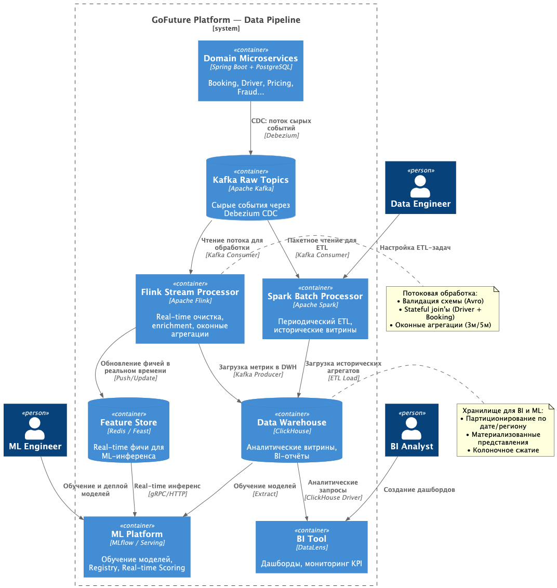

# Задание 4. Data Pipeline для ML и BI

## Контекст

Текущий сбор данных в `GoFuture` фрагментирован: события обрабатываются разрозненными Celery-задачами, отсутствуют
единые фичи для ML-моделей динамического ценообразования и фрода, BI-отчёты формируются с задержкой. Для реализации
data-driven решений требуется единый, масштабируемый пайплайн, объединяющий все 8 доменных сервисов, ML-платформу и
BI-инструменты (DataLens).

## Требования

- Сбор данных из всех микросервисов в реальном времени и пакетно.
- Единая обработка: stream (Flink) + batch (Spark).
- Хранение фич для real-time ML-инференса.
- Интеграция с ML-платформой (обучение, registry, scoring).
- Интеграция с BI (ClickHouse + DataLens).
- Механизмы обеспечения качества данных (валидация, lineage, SLA).

---

## Решение

### 1. Архитектура пайплайна

| Этап                  | Компонент                                  | Задача                                                                                                                                |
|-----------------------|--------------------------------------------|---------------------------------------------------------------------------------------------------------------------------------------|
| **Ingestion**         | Debezium CDC → Kafka Raw Topics            | Асинхронный захват изменений БД без нагрузки на микросервисы. Schema Registry (Avro) гарантирует совместимость контрактов.            |
| **Stream Processing** | Apache Flink                               | Очистка, enrichment, stateful-join'ы, оконные агрегации (tumbling/sliding). Публикация готовых метрик обратно в Kafka.                |
| **Batch Processing**  | Apache Spark (scheduled)                   | ETL исторических данных, коррекция дрейфа, формирование витрин для offline-обучения моделей.                                          |
| **Storage**           | Feature Store (Feast + Redis) / ClickHouse | Redis: low-latency фичи для real-time scoring. ClickHouse: аналитические таблицы, материализованные представления, long-term storage. |
| **Consumption**       | ML Platform / DataLens                     | ML: загрузка фич, training, deployment модели, feedback loop. BI: ad-hoc запросы, дашборды, KPI-мониторинг.                           |

### 2. Диаграмма C4: Пайплайн данных (PlantUML)

**Файл:** `./c2-data-pipeline.puml`

### 3. Механизмы обеспечения качества данных

| Механизм                     | Реализация                                                              | Зачем нужен                                                                                                            |
|------------------------------|-------------------------------------------------------------------------|------------------------------------------------------------------------------------------------------------------------|
| **Schema Validation**        | Confluent Schema Registry (Avro/Protobuf) + strict compatibility checks | Гарантирует, что потребители не упадут из-за изменений контрактов. Fail-fast при нарушении схемы.                      |
| **Data Profiling & Testing** | Great Expectations (в Spark/Flink pipeline)                             | Автоматические проверки: `not_null`, `unique`, `valid_range`, `row_count`. Пайплайн падает или алертит при нарушении.  |
| **Data Lineage**             | OpenLineage + Marquez                                                   | Отслеживание происхождения данных от микросервиса до BI-дашборда. Упрощает аудит и root-cause analysis при инцидентах. |
| **SLA Monitoring**           | Freshness (<2 мин), Completeness (>99%), Accuracy (cross-check с БД)    | Prometheus-метрики + Alertmanager. Автоматический перевод фич в `degraded` mode при нарушении SLA.                     |
| **Error Handling & Replay**  | Dead Letter Queue (Kafka) + idempotent consumers                        | Poison messages изолируются, не ломают pipeline. Инженер исправляет и перезапускает обработку по `event_id`.           |

---

## Альтернативы

| Вариант                                  | Плюсы                                      | Минусы                                                              | Почему отклонён                                                     |
|------------------------------------------|--------------------------------------------|---------------------------------------------------------------------|---------------------------------------------------------------------|
| Spark Structured Streaming вместо Flink  | Единый стек для batch+stream, проще деплой | Выше latency, тяжелее state management, больше GC-пауз              | Не соответствует требованию real-time pricing (<200ms)              |
| Data Lake (S3/Iceberg) вместо ClickHouse | Гибкая схема, дешево для cold data         | Медленные ad-hoc запросы, сложнее BI-интеграция                     | DataLens оптимизирован под columnar DWH, а не object storage        |
| Ручная валидация данных в коде           | Быстро на старте                           | Не масштабируется, высокий human error, нет централизованных правил | Great Expectations даёт декларативные чеклисты и интеграцию в CI/CD |

## Компромиссы

- **Операционная сложность**: Поддержка Flink + Spark + Feature Store требует выделенной Data-команды. Митигация:
  Kubernetes-операторы, стандартные Helm-чарты, GitOps-конфигурация.
- **Двойное хранение**: Данные дублируются в Redis (Feature Store) и ClickHouse (DWH). Митигация: Redis хранит только
  hot-фичи с TTL, ClickHouse — long-term агрегаты.
- **Задержка обучения моделей**: Offline-треннинг на ClickHouse может занимать часы. Митигация: инкрементальное
  обучение, feature snapshots, async model deployment.