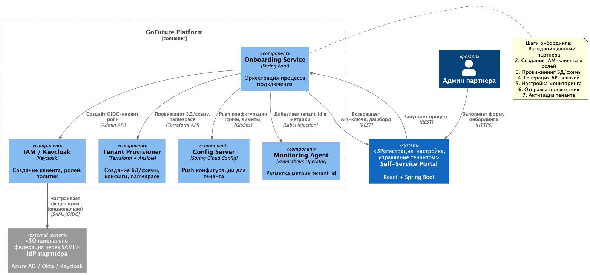
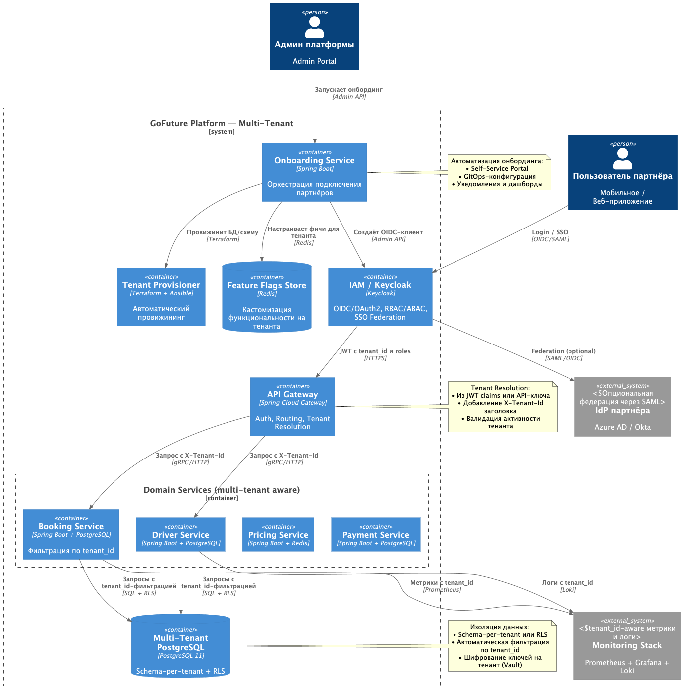

# Задание 5. Мультитенантность, IAM и Onboarding

## Контекст

«GoFuture» планирует быстрый запуск решений для партнёров в новых регионах. Требуется мультитенантная платформа с полной
изоляцией данных между партнёрами, кастомизацией функциональности, единым управлением доступом (IAM/SSO) и
автоматизированным онбордингом. Текущий монолит не поддерживает изоляцию на уровне данных и гибкую настройку прав
доступа.

## Требования

- Модель изоляции данных между партнёрами (тенантами).
- IAM-система с ролевым доступом (RBAC) и атрибутивным контролем (ABAC), поддержка SSO.
- Автоматизированный процесс подключения новых партнёров (onboarding).
- Система мониторинга мультитенантного окружения (метрики, алерты, аудит).
- Диаграммы C2/C3 с интеграцией IAM, мониторинга и потоков онбординга.
- Таблица ролей и уровней доступа к данным.

---

## Решение

### 1. Модель изоляции данных (гибридный подход)

| Тир партнёра                              | Модель изоляции                  | Обоснование                                                                                    | Хранилище                                    |
|-------------------------------------------|----------------------------------|------------------------------------------------------------------------------------------------|----------------------------------------------|
| **Enterprise** (крупные такси-агрегаторы) | `Database-per-Tenant`            | Полная изоляция, соответствие строгим регуляторным требованиям, отдельный бэкап/восстановление | Выделенная PostgreSQL схема/инстанс          |
| **Mid-tier** (региональные операторы)     | `Schema-per-Tenant`              | Баланс между изоляцией и стоимостью, общие ресурсы БД, логическое разделение                   | Общая PostgreSQL, отдельная схема на тенанта |
| **Freemium** (стартапы, тестовые)         | `Row-Level Security + tenant_id` | Минимальная стоимость, быстрое подключение, достаточная изоляция для некритичных данных        | Общая таблица с `tenant_id` + RLS-политики   |

**Принципы:**

- Все запросы к БД автоматически фильтруются по `tenant_id` через Hibernate-фильтры или PostgreSQL RLS.
- Кросс-тенантные запросы возможны только для платформенных сервисов (Analytics, Billing) с явным аудитом.
- Шифрование ключей БД уникально на тенант (через Vault).

---

### 2. IAM и SSO архитектура

**Выбранный инструмент:** Keycloak (OIDC/OAuth2)

```
Клиент → Keycloak (Auth) → JWT с claims → API Gateway → Микросервисы
```

**Ключевые элементы:**

| Компонент           | Задача                                                                                                                          |
|---------------------|---------------------------------------------------------------------------------------------------------------------------------|
| **Keycloak**        | Централизованная аутентификация, управление пользователями, ролями, клиентами. Поддержка SAML/OIDC для корпоративных партнёров. |
| **JWT с claims**    | Токен содержит `tenant_id`, `roles`, `permissions`, `exp`. Подписывается RS256, валидируется на Gateway.                        |
| **API Gateway**     | Терминирует JWT, извлекает `tenant_id`, добавляет в заголовок `X-Tenant-Id` для downstream-сервисов.                            |
| **RBAC + ABAC**     | Роли (`admin`, `driver_manager`, `analyst`) + атрибуты (`region=sea`, `tier=enterprise`) для детального контроля доступа.       |
| **SSO Integration** | Партнёры могут подключить свой IdP (Azure AD, Okta) через SAML federation.                                                      |

**Поток аутентификации:**

1. Пользователь логинится через `/login?tenant=partner-xyz`.
2. Keycloak проверяет реквизиты для входа, выдаёт JWT с `tenant_id=partner-xyz`, `roles=[...]`.
3. Gateway валидирует JWT, пробрасывает `X-Tenant-Id` в сервисы.
4. Сервисы применяют фильтрацию по `tenant_id` на уровне БД/кода.

---

### 3. Автоматизированный онбординг партнёров (Flow)

**Файл:** `./c3-onboarding-flow.puml`



**Этапы онбординга:**

| Шаг | Действие                                      | Артефакт                                             |
|-----|-----------------------------------------------|------------------------------------------------------|
| 1   | Партнёр заполняет форму в Self-Service Portal | Заявка с `company_name`, `region`, `tier`, `contact` |
| 2   | Валидация и проверка на дубликаты             | `OnboardingRequest` в статусе `validated`            |
| 3   | Создание OIDC-клиента в Keycloak              | `client_id`, `client_secret`, realm-конфиг           |
| 4   | Провижининг инфраструктуры                    | БД/схема, Kubernetes namespace, config maps          |
| 5   | Генерация API-ключей и initial config         | `API_KEY`, webhook URL, feature flags                |
| 6   | Настройка мониторинга                         | Prometheus labels `tenant_id=xyz`, алерты            |
| 7   | Отправка приветствия и активация              | Письмо с инструкциями, дашборд, статус `active`      |

---

### 4. Мультитенантный мониторинг

**Подход:** Все метрики, логи и трейсы обогащаются `tenant_id` для изоляции и агрегации.

| Тип          | Метрика / Лог                                                                | Инструмент                            | Назначение                                           |
|--------------|------------------------------------------------------------------------------|---------------------------------------|------------------------------------------------------|
| **Метрики**  | `http_requests_total{tenant_id="xyz"}`, `db_query_duration{tenant_id="xyz"}` | Prometheus + tenant-aware dashboards  | Мониторинг нагрузки и производительности на тенанта  |
| **Алерты**   | `tenant_error_rate > 5% for 5m`, `quota_exceeded{tenant_id="xyz"}`           | Alertmanager + routing by `tenant_id` | Уведомление команды партнёра или внутренней SRE      |
| **Логи**     | Structured logs с `tenant_id`, `user_id`, `action`                           | Loki + labels                         | Аудит действий, расследование инцидентов             |
| **Трейсинг** | OpenTelemetry spans с `tenant.id` attribute                                  | Tempo/Jaeger                          | Отладка кросс-сервисных запросов в контексте тенанта |
| **Аудит**    | `audit_log{action="data_export", tenant_id="xyz", user="admin"}`             | Immutable S3 + SIEM                   | Compliance-отчётность, детекция аномалий             |

**Изоляция алертов:**

- Партнёры уровня Enterprise получают доступ к приватному Grafana-дашборду.
- Алерты маршрутизируются: `tenant.tier=enterprise` → dedicated Slack channel, `freemium` → общий канал с приоритетом
  lower.

---

### 5. Диаграмма C2: Мультитенантная платформа с IAM

**Файл:** `./c2-multi-tenant-iam.puml`



---

### 6. Таблица ролей и уровней доступа

| Роль             | Область действия                   | Доступ к данным                                             | Разрешения                                                        | Механизм аутентификации                       |
|------------------|------------------------------------|-------------------------------------------------------------|-------------------------------------------------------------------|-----------------------------------------------|
| `superadmin`     | Платформа (все тенанты)            | Полный доступ ко всем данным, аудит-логи                    | Управление тенантами, глобальные настройки, просмотр всех метрик  | MFA + SSO (внутренний IdP)                    |
| `tenant_admin`   | Один тенант                        | Данные только своего тенанта                                | Управление пользователями тенанта, настройка фич, просмотр метрик | OIDC / SAML (свой или федеративный IdP)       |
| `driver_manager` | Один тенант                        | Профили водителей, статусы, геопозиции (только свой тенант) | Назначение смен, блокировка водителей, экспорт отчётов            | JWT с `tenant_id` + RBAC                      |
| `analyst`        | Один тенант                        | Агрегированные данные (без PII), BI-витрины                 | Построение дашбордов, экспорт в CSV, доступ к DataLens            | JWT + ABAC (`region`, `data_sensitivity`)     |
| `support`        | Несколько тенантов (по назначению) | Частичный доступ: только необходимые для тикета данные      | Просмотр логов, сброс паролей, эскалация инцидентов               | JWT с ограниченным `scope` + временный доступ |
| `api_partner`    | Один тенант                        | Только публичные API-эндпоинты, без прямого доступа к БД    | Вызов REST API с лимитами, webhook-получение событий              | API Key + HMAC signature                      |
| `system`         | Внутренние сервисы                 | Полный доступ в рамках своей доменной ответственности       | Межсервисная коммуникация, фоновые задачи                         | mTLS + service account JWT                    |

**Принципы:**

- Все роли наследуют `tenant_id` из контекста аутентификации.
- Доступ к данным проверяется на уровне сервиса (Hibernate-фильтры) и БД (RLS).
- Критичные действия (удаление, экспорт) логируются в аудит-трек.

---

## Альтернативы

| Вариант                                            | Плюсы                                           | Минусы                                                                      | Почему отклонён                                                               |
|----------------------------------------------------|-------------------------------------------------|-----------------------------------------------------------------------------|-------------------------------------------------------------------------------|
| Единая БД без изоляции (только `tenant_id`)        | Проще в разработке и миграции                   | Риск утечки данных между тенантами, не соответствует Enterprise-требованиям | Не обеспечивает достаточную изоляцию для крупных партнёров                    |
| Полностью отдельные инстансы БД на каждого тенанта | Максимальная изоляция, независимый бэкап        | Высокая стоимость, сложность управления, медленный онбординг                | Не масштабируется на сотни/тысячи мелких партнёров                            |
| CAS вместо Keycloak                                | Знакомый стек для некоторых энтерпрайз-клиентов | Меньшая гибкость в управлении ролями, слабая поддержка OIDC                 | Keycloak лучше интегрируется с Spring Boot и поддерживает многопротокольность |

## Компромиссы

- **Сложность запросов**: Гибридная модель изоляции требует абстракции доступа к данным (репозитории с automatic
  `tenant_id` injection). Митигация: общий Hibernate-интерцептор + code generation для RLS-политик.
- **Производительность**: RLS-фильтрация на больших таблицах может замедлять запросы. Митигация: индексы по `tenant_id`,
  партиционирование, кэширование горячих данных.
- **Управление секретами**: Каждый тенант имеет свои API-ключи и креды БД. Митигация: HashiCorp Vault с динамическими
  секретами и авто-ротацией.